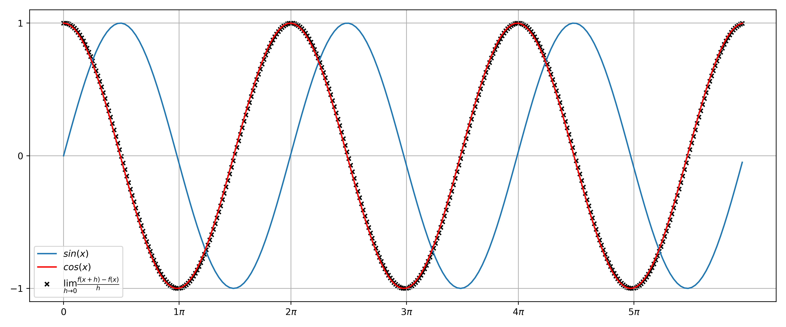

# Code Journal

This repo has small codes and algorithms that I do for fun. Sometimes my brain tries to be nerd.
<br />
All entries should soon have a pdf file that explains the idea behind each code.<br />

## Content

### Entry 001 [Water Droplet Model](https://github.com/the-other-mariana/code-journal/tree/master/droplet-model)

An intuitive equation to create a water drop form, written in Mathematica. The [pdf](https://github.com/the-other-mariana/code-journal/blob/master/droplet-model/CJ01_WaterShader.pdf) shows the pipeline.<br />

<br />

### Entry 002 [Line Flowers](https://github.com/the-other-mariana/code-journal/tree/master/line-flowers)

Some program in Python that makes random flowers. The [pdf](https://github.com/the-other-mariana/code-journal/blob/master/line-flowers/CJ02_LineFlowers.pdf) shows the pipeline.<br />

<br />

### Entry 003 [Custom Line Module](https://github.com/the-other-mariana/code-journal/tree/master/line)

Some program in Python that implements a line function to paint a straight line from point to point inside an image. The [pdf](https://github.com/the-other-mariana/code-journal/blob/master/line/CJ03_PolarLine.pdf) shows the pipeline.<br />

<br />

### Entry 004 [Worm-like Animation](https://github.com/the-other-mariana/code-journal/tree/master/worm)

Small Mathematica notebook that creates a worm-like animation in a .mov file. The preview output is the following.<br />

<br />

### Entry 005 [Flower Torus Mesh](https://github.com/the-other-mariana/torus-worm)

Script in Python that creates a flower-like torus object in Autodesk Maya. The [pdf](https://github.com/the-other-mariana/torus-worm/blob/master/results/CJ05_SineTorus.pdf) shows the overall algorithm. <br />

 <br />

### Entry 006 [Regular Polygon Spiral](https://github.com/the-other-mariana/code-journal/tree/master/poly-spiral)

Some program in Python that draws an exact regular polygon spiral image, importing my custom line module from Entry 003. The [pdf](https://github.com/the-other-mariana/code-journal/blob/master/poly-spiral/CJ06_PolygonSpiral.pdf) shows the pipeline and mathematical analysis to make it exact for any polygon. I had so much fun.<br />

<br />

### Entry 007 [Fractal Tree](https://github.com/the-other-mariana/code-journal/tree/master/fractal)

Some program in Python that draws a simple fractal tree, importing my custom line module from Entry 003. A sample output I got was the following.<br />

<br />

### Entry 008 [Sierpinski Triangle](https://github.com/the-other-mariana/code-journal/tree/master/sierpinski-triangle)

Program in Python that draws a Sierpinski Triangle fractal, importing my custom line module from Entry 003. The [pdf file](https://github.com/the-other-mariana/code-journal/blob/master/sierpinski-triangle/CJ08_SierpinskiTriangle.pdf) explains the logic followed. <br />

<br />

### Entry 009 [Koch Curve Snowflake](https://github.com/the-other-mariana/code-journal/tree/master/koch-snowflake)

Program in Python that draws a Koch Snowflake fractal, importing my custom line module from Entry 003. The [pdf](https://github.com/the-other-mariana/code-journal/blob/master/koch-snowflake/CJ09_KochCurve.pdf) shows the algorithm followed. <br />

<br />

### Entry 010 [Longest Unique Substring](https://github.com/the-other-mariana/code-journal/tree/master/longest-unique-string)

Program in Python that, given a string, finds the length of the longest substring without repeating characters. <br />

#### Output

```
Input: "awwebbz"
Output: 3	// "web"
```

### Entry 011 [Numerical Derivative Visualization](https://github.com/the-other-mariana/code-journal/tree/master/deriv)

Program in Python that approximates the derivative of a function (sine function) using the limit definition of the derivative. The [pdf](https://github.com/the-other-mariana/code-journal/blob/master/deriv/CJ11_Deriv.pdf) explains the logic followed.

