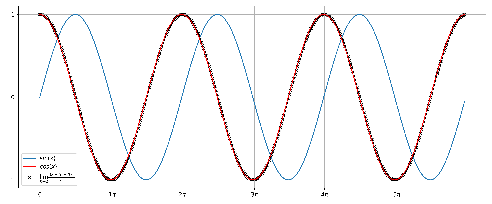

# Numerical Derivative Visualization

Program in Python that approximates the derivative of a function (sine function) using the limit definition of the derivative:

=\lim_{h\to0}\frac{f(x+h)-f(x)}{h})

And by evaluating said limit of h approaching 0, wich basically means **when h value is arbitraily small**, even if the expression is unsolvable for h = 0. The increment of the x axis is h, which is quite small as mentioned, and thus the fraction that the limit encloses outputs the derivative of f(x) in said point of x axis. The [pdf](https://github.com/the-other-mariana/code-journal/blob/master/deriv/CJ11_Deriv.pdf) explains the logic followed.

