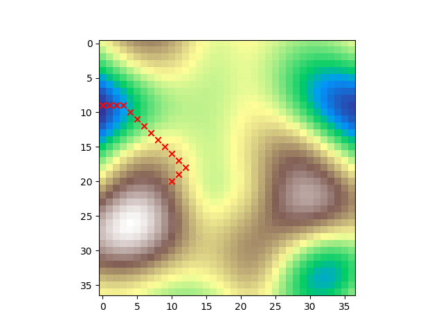
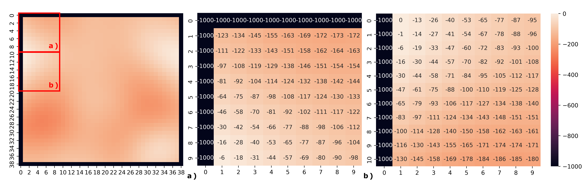

# Shortest Path With Bellman Optimality Equations

## Bellman's Optimality Equations

Bellman's Optimality Equations for Q Learning are expressed for each state s and action a as:

$Q(s,a) = \sum_{s_f \in S}{P_{MT}(s_f|s,a) \cdot (f_R(s,a,s_f) + \gamma \max_{a_f}{Q(s_f, a_f)})} $

Specifically, since a simple grid problem is considered **deterministic**, the sum using the product of the probabilities for each $s_f$ can be ignored:

$Q(s,a) = f_R(s,a,s_f) + \gamma \max_{a_f}{Q(s_f, a_f)} $,

where $s_f$ is defined as:

$s_f = f_{TM}(s, a)$,

considering $f_{MT}$ is a matrix of dimensions $S \times A$ with the indices of the arrival states given state $s$ and action $a$. In this case, $S = \{s_0, s_1, ..., s_{N \times N}\}$ for a grid of $N$ cells.

## Optimal Policy Exploitation

With a matrix of costs given by perlin noise values, we can also calculate the optimal policy from a random point. But now, we will have **multiple possible goals**, since the blue areas are many and they can **accumulate a better policy** when compared **to other** farther blue areas anc considering the start point positioned randomly.

The costs or punishments look like this:

Where a bounding cell on each frame limit has a cost of -1000.