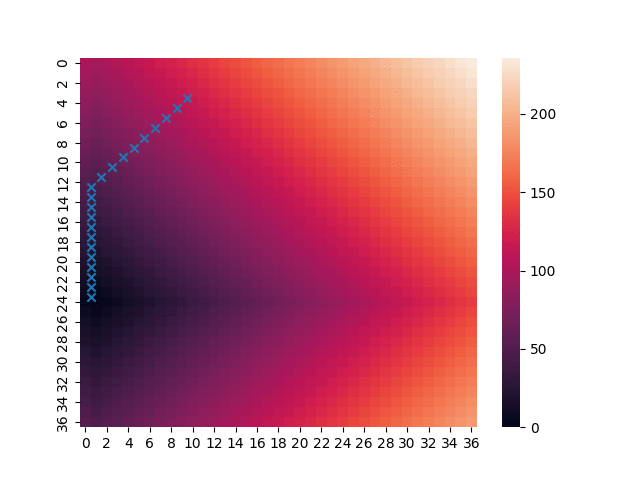

# Shortest Path With Bellman Optimality Equations

## Cost Matrix

For the cost matrix, we calculate it from the *h(n)* function of the A Star algorithm that runs inside a simple game in Unity. the *h(n)* function is:

```c#
public float hCalculate(int idnode, int idTarget)
    {
        int col1, row1, col2, row2;
        double cost;

        col1 = GetCol(idnode);
        row1 = GetRow(idnode);
        col2 = GetCol(idTarget);
        row2 = GetRow(idTarget);
        //NodeA nodeAnalyzed = nodesA [row2, col2];

        cost = Math.Abs(col2 - col1) * sizecell;
        cost = cost + Math.Abs(row2 - row1) * sizecell;

        h[row1, col1] = (float)cost;

        return ((float)cost);
    }
```
and for all nodes in a grid, `nodesA[rows, cols]`, the *h* cost is:

```c#
for (int i = 0; i < rows; i++)
{
    for (int j = 0; j < cols; j++)
    {
        int cid = myGraph.nodesA[i, j].idNode;
        int sid = startNode.idNode;
        int tid = targetNode.idNode;
        float hcost = myGraph.hCalculate(myGraph.nodesA[i, j].idNode, targetNode.idNode);
        s += hcost + " ";

    }
    s += "\n";
}
File.WriteAllText("C:\\Users\\mariana\\Documents\\github-mariana\\code-journal\\path\\cost.txt", s);
```

In A Star algorithm, *h(n)* is a heuristic function that estimates the cost of the cheapest path from n to the goal. The heuristic function is problem-specific.

The cost matrix looks as follows, where the 0 value (lowest) is the target cell and any other cell can be the start cell.


## Bellman's Optimality Equations

Bellman's Optimality Equations for Q Learning are expressed for each state s and action a as:

$Q(s,a) = \sum_{s_f \in S}{P_{MT}(s_f|s,a) \cdot (f_R(s,a,s_f) + \gamma \max_{a_f}{Q(s_f, a_f)})} $

Specifically, since a simple grid problem is considered **deterministic**, the sum using the product of the probabilities for each $s_f$ can be ignored:

$Q(s,a) = f_R(s,a,s_f) + \gamma \max_{a_f}{Q(s_f, a_f)} $,

where $s_f$ is defined as:

$s_f = f_{TM}(s, a)$,

considering $f_{MT}$ is a matrix of dimensions $S \times A$ with the indices of the arrival states given state $s$ and action $a$. In this case, $S = \{s_0, s_1, ..., s_{N \times N}\}$ for a grid of $N$ cells.

## Optimal Politic Exploitation

Here there are some sample trayectories from random start points to the goal using the optimal politic resulting from Bellman's Optimality Equations for Q Learning:

